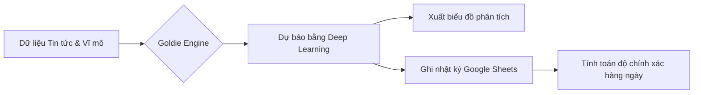

  

  

 

---

### Tổng quan dự án

**Goldie AI** là một hệ thống dự báo giá vàng thông minh, kết hợp giữa mô hình mạng thần kinh **LSTM (Long Short-Term Memory)** và phân tích tâm lý thị trường thông qua **NLP**. Dự án tập trung vào việc định lượng các biến số kinh tế vĩ mô và tin tức địa chính trị để đưa ra dự báo xu hướng giá trong ngắn hạn.

> "Predicting the future is not magic, it's mathematics and sentiment."

---

### Tính năng chính

- **Multivariate LSTM Model**: Phân tích đồng thời các biến số: Giá vàng (GLD), Lãi suất FED, Chỉ số sợ hãi VIX và Sentiment tin tức.
- **NLP Sentiment Analysis**: Tự động thu thập tin tức từ NewsAPI và định lượng mức độ tác động của các sự kiện kinh tế bằng VADER.
- **Automated Logging**: Hệ thống tự động ghi nhật ký dự đoán vào Google Sheets, thực hiện đối soát giá thực tế và tính toán độ chính xác hàng ngày.
- **Seamless Pipeline**: Tự động hóa hoàn toàn quy trình từ thu thập dữ liệu (Crawling), Tiền xử lý đến Huấn luyện và Xuất báo cáo.

---

### Công nghệ sử dụng

  
  
  
  
  

| Thành phần | Công nghệ | Vai trò |
| :--- | :--- | :--- |
| **Core Model** | **LSTM (RNN)** | Huấn luyện dữ liệu chuỗi thời gian |
| **NLP Engine** | **VADER Sentiment** | Phân tích tâm lý tin tức tài chính |
| **Data Source** | **YFinance & FRED API** | Truy xuất dữ liệu giá và kinh tế vĩ mô |
| **Deployment** | **Google Colab** | Thực thi Pipeline và huấn luyện mô hình |
| **Dashboard** | **Google Sheets** | Lưu trữ nhật ký và đánh giá độ chính xác |

---

### Phân tích hệ thống (Framework)

| Đặc tính | Chi tiết kỹ thuật | Mục tiêu |
| :--- | :--- | :--- |
| **Dữ liệu đầu vào** | GLD, DFF (FED), VIX, Sentiment Score. | Tối ưu hóa độ chính xác qua đa biến số. |
| **Xử lý ngôn ngữ** | NewsAPI kết hợp VADER Analysis. | Định lượng hóa tác động của tin tức địa chính trị. |
| **Lưu trữ** | Google Sheets API integration. | Đảm bảo tính minh bạch và theo dõi hiệu suất. |
| **Bảo mật** | Google Colab Secrets Management. | Bảo vệ API Keys và Tokens của hệ thống. |

---

### Quy trình vận hành (Workflow)

---

### Nhật ký dự đoán mẫu (Example Log)
>[!IMPORTANT]
>**Lưu ý:** Tất cả dữ liệu giá vàng trong hệ thống Goldie AI được tính theo đơn vị Chỉ (1 Chỉ = 3.75 gram). Vui lòng không nhầm lẫn với đơn vị Lượng/Cây (1 Cây = 10 Chỉ).

| Ngày Dự Báo | Giá Dự Báo (USD) | Giá Thực Tế (USD) | Chênh Lệch ($) | Độ Chính Xác (%) |
| :--- | :--- | :--- | :--- | :--- |
| **2026-04-19** | `395.10` | `394.85` | `0.25` | **99.94%** |
| **2026-04-20** | `396.87` | `398.12` | `1.25` | **99.68%** |
| **2026-04-21** | `398.20` | `...` | `...` | `Pending` |

---
### Cài đặt và Thực thi
	1.	Clone repository:

	2.	Cấu hình Secrets: Thiết lập FRED_API_KEY, NEWSAPI_KEY, và GITHUB_TOKEN trong môi trường thực thi (Google Colab Secrets).
  
	3.	Chạy Pipeline: Thực thi file notebook hoặc script để bắt đầu quá trình dự báo.

  >[!IMPORTANT]
>Lưu ý về API Key: Bạn cần tự đăng ký và sở hữu API Key cá nhân từ FRED và NewsAPI để hệ thống có thể thu thập dữ liệu thực tế.

  
   
  Dự án được thực hiện bởi <b>Nguyễn Đức Phát</b> - Sinh viên AI, Đại học Sài Gòn (SGU)

